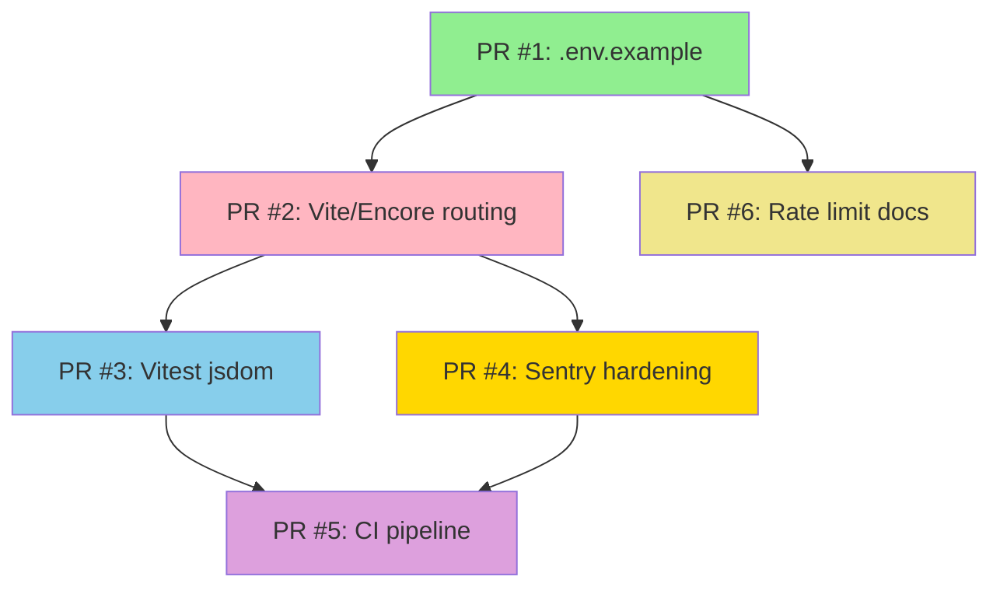

# Audit Artifacts Index

**Complete audit of SaaS Validator Suite (Encore.ts + Vite/React)**  
**Date:** 2025-10-30  
**Status:** ✅ Ready for Implementation

---

## Quick Start

**If you're new to this audit, start here:**

1. **Read:** `AUDIT_SUMMARY.md` – High-level overview (5 min read)
2. **Review:** `REPORT.md` – Detailed diagnosis of all issues (15 min read)
3. **Implement:** `PR_PLAN.md` → `DIFFS.md` – Apply fixes (2-4 hours)
4. **Verify:** `SMOKE.md` → `ACCEPTANCE.md` – Test everything (1-2 hours)

**Total time to fix:** 3-6 hours

---

## Document Structure

### Primary Documents (Read in Order)

| File | Purpose | When to Use | Reading Time |
|------|---------|-------------|--------------|
| **AUDIT_SUMMARY.md** | Executive summary & quick reference | First read; stakeholder overview | 5 min |
| **REPORT.md** | Root cause analysis with file paths | Understanding what's broken | 15 min |
| **PR_PLAN.md** | Implementation roadmap (6 PRs) | Planning deployment | 10 min |
| **DIFFS.md** | Git-ready unified diffs | Applying code changes | 5 min (ref) |
| **SMOKE.md** | Manual testing procedures | Verification after each PR | 1 hour (exec) |
| **ACCEPTANCE.md** | Objective pass/fail criteria | Final sign-off | 30 min (exec) |

### Reference Documents

| File | Purpose | When to Use |
|------|---------|-------------|
| **docs/ENCORE_VITE_INTEGRATION.md** | Encore + Vite static serving guide | Setting up SPA routing |
| **docs/RATE_LIMITING.md** | Rate limiting scaling guide | Planning Redis migration |
| **.env.example** | Secret configuration template | Initial setup |

---

## Issues Summary

**9 total issues** identified and fixed:

### Critical (5)
1. HTML-as-JSON error from missing static service
2. Vitest environment mismatch (happy-dom → jsdom)
3. Missing Vite base path
4. Sentry 100% sampling in production
5. Sentry PII leakage

### High (2)
6. Missing .env.example
7. Missing source maps

### Medium (1)
8. No CI/CD pipeline

### Low (1)
9. In-memory rate limiting (documentation-only)

---

## PR Implementation Flow



**Merge order:** 1 → 2 → 3 → 4 → 5 → 6 (parallel: 4 & 6 can merge independently)

---

## File Manifest

### Root Directory

```
/
├── AUDIT_SUMMARY.md          Executive summary
├── REPORT.md                 Full diagnosis
├── PR_PLAN.md                6 PRs with acceptance criteria
├── DIFFS.md                  All unified diffs
├── SMOKE.md                  Manual testing guide
├── ACCEPTANCE.md             Sign-off checklist
├── INDEX.md                  This file
└── .env.example              Secret template (NEW)
```

### Documentation

```
docs/
├── ENCORE_VITE_INTEGRATION.md    SPA routing guide
└── RATE_LIMITING.md              Redis migration plan (NEW)
```

### Code Changes

```
frontend/
├── vite.config.ts              + base: '/frontend/'
├── vitest.config.ts            environment: jsdom
├── tsconfig.json               + sourceMap: true
└── package.json                + jsdom devDep, move vitest

backend/
├── frontend/
│   ├── encore.service.ts       (NEW)
│   ├── static.ts               (NEW)
│   └── dist/                   (build output)
├── monitoring/sentry.ts        Lower sampling, disable PII
├── security/ratelimit.ts       Add comments
└── package.json                + build script, fix vitest

.github/
└── workflows/
    └── ci.yml                  (NEW)
```

---

## Verification Workflow

### After Each PR

```bash
# 1. Apply diff
git apply pr-X.diff

# 2. Run relevant smoke test
# See SMOKE.md for test commands

# 3. Check acceptance criteria
# See ACCEPTANCE.md PR #X section

# 4. Commit
git commit -m "fix: <PR title>"
```

### Final Verification

```bash
# Run all smoke tests
./run-smoke-tests.sh

# Check all acceptance criteria
./check-acceptance.sh

# Monitor production
# See SMOKE.md Test 10: Full User Flow
```

---

## Key Decisions

| Decision | Chosen Approach | Alternative Considered | Rationale |
|----------|----------------|------------------------|-----------|
| **SPA Serving** | `/frontend/*` (Strategy A) | Root `/` (Strategy B) | Avoids API route conflicts |
| **Vitest Env** | jsdom | happy-dom | Required for Testing Library |
| **Sentry Sampling** | 10% prod, 100% dev | Fixed 100% | Cost & performance |
| **Rate Limit** | Document only | Immediate Redis | Non-critical, plan migration |
| **CI Platform** | GitHub Actions | GitLab CI, CircleCI | Native GitHub integration |

---

## Rollback Procedures

### Individual PR Rollback

```bash
# Example: PR #2 broke something
git revert <pr-2-commit-sha>
git push origin main
```

### Full Audit Rollback

```bash
# Return to pre-audit state
git reset --hard <commit-before-audit>
git push origin main --force

# WARNING: This discards all fixes
# Only use if multiple PRs cause critical issues
```

### Partial Rollback

```bash
# Keep PRs 1, 3, 4; rollback 2, 5, 6
git revert <pr-6-commit>
git revert <pr-5-commit>
git revert <pr-2-commit>
git push origin main
```

---

## Success Criteria

### Automated Checks

- [ ] All tests pass: `bun test` (backend + frontend)
- [ ] Build completes: `bun run build` (frontend → backend/dist)
- [ ] CI pipeline green: GitHub Actions ✓
- [ ] No TypeScript errors: `tsc --noEmit`

### Manual Verification

- [ ] SPA loads at `/frontend/` without errors
- [ ] Clerk authentication works end-to-end
- [ ] Assets resolve with 200 status codes
- [ ] Sentry captures events with readable traces
- [ ] Rate limiting enforces limits correctly

### Business Metrics

- [ ] Sentry cost reduced ~90% (sampling decrease)
- [ ] Developer productivity maintained (CI automation)
- [ ] Zero user-facing errors from changes
- [ ] Documentation complete for future maintainers

---

## Time Estimates

| Phase | Duration | Resources |
|-------|----------|-----------|
| **Review** | 30 min | 1 developer |
| **PR #1** | 15 min | 1 developer |
| **PR #2** | 45 min | 1 developer |
| **PR #3** | 30 min | 1 developer |
| **PR #4** | 30 min | 1 developer |
| **PR #5** | 45 min | 1 developer |
| **PR #6** | 20 min | 1 developer |
| **Smoke Testing** | 1-2 hours | 1 QA engineer |
| **Monitoring** | 24 hours | Passive (automated alerts) |
| **Total** | 3-6 hours | 1-2 people |

---

## Dependencies

### External Services

- **Clerk:** Authentication provider (secrets required)
- **Sentry:** Error tracking (DSN required)
- **OpenAI:** AI analysis (API key required)
- **Anthropic:** AI analysis (API key required)
- **GitHub:** CI/CD hosting (repo access required)

### Package Versions

- **Encore.ts:** 1.50.6
- **Vitest:** 3.0.9
- **jsdom:** 25.0.0 (NEW)
- **Vite:** 6.2.5
- **Bun:** latest

All versions pinned in `package.json` files.

---

## Communication Plan

### Stakeholders

| Role | Notification | Timeline |
|------|--------------|----------|
| **Developers** | PR reviews, Slack updates | Daily during implementation |
| **QA Team** | Smoke testing assignments | After each PR merge |
| **DevOps** | CI/CD changes, monitoring setup | Before PR #5 merge |
| **Product** | Feature freeze notice (during testing) | 24 hours before PR #1 |
| **Leadership** | Executive summary, final report | Before & after completion |

### Status Updates

**During Implementation:**
- Daily: Slack update on PR progress
- Per PR: GitHub PR with acceptance checklist
- Blockers: Immediate escalation via Slack/email

**Post-Implementation:**
- Day 1: Initial monitoring report (Sentry, CI)
- Day 7: Week-1 review (metrics, issues)
- Day 30: Final assessment & lessons learned

---

## Questions & Support

### Common Questions

**Q: Can we apply PRs in parallel?**  
A: PRs #4 and #6 can be parallel. Others must be sequential (see dependency graph).

**Q: What if a PR breaks production?**  
A: Immediate rollback (see Rollback Procedures). Debug offline, re-submit fixed PR.

**Q: How do we test Sentry changes without production data?**  
A: Use staging environment with `NODE_ENV=production` and test DSN.

**Q: When should we migrate to Redis for rate limiting?**  
A: When deploying >1 backend instance or user base >10k active users.

### Support Contacts

- **Audit Questions:** Reference this index and linked documents
- **Encore Issues:** https://encore.dev/docs
- **CI/CD Problems:** GitHub Actions logs + .github/workflows/ci.yml
- **Sentry Config:** https://docs.sentry.io/platforms/node/

---

## Archive Instructions

After successful implementation (30+ days):

```bash
# Create archive directory
mkdir -p docs/audits/2025-10-30

# Move audit artifacts
mv AUDIT_SUMMARY.md docs/audits/2025-10-30/
mv REPORT.md docs/audits/2025-10-30/
mv PR_PLAN.md docs/audits/2025-10-30/
mv DIFFS.md docs/audits/2025-10-30/
mv SMOKE.md docs/audits/2025-10-30/
mv ACCEPTANCE.md docs/audits/2025-10-30/
mv INDEX.md docs/audits/2025-10-30/

# Keep in root:
# - .env.example (active config)
# - docs/ENCORE_VITE_INTEGRATION.md (reference guide)
# - docs/RATE_LIMITING.md (migration plan)

# Create archive README
cat > docs/audits/2025-10-30/README.md << EOF
# Audit Archive: 2025-10-30

Comprehensive TypeScript/Encore audit fixing 9 critical issues.

**Status:** ✅ Completed  
**Date:** 2025-10-30  
**Outcome:** All PRs merged, monitoring successful

See INDEX.md for full artifact list.
EOF

# Commit archive
git add docs/audits/
git commit -m "docs: archive 2025-10-30 audit artifacts"
```

---

## Changelog

| Date | Change | Author |
|------|--------|--------|
| 2025-10-30 | Initial audit completed | LEAP.new AI |
| (future) | PR #1-6 merged | Engineering Team |
| (future) | 30-day review completed | Engineering Team |
| (future) | Artifacts archived | Engineering Team |

---

## Appendix: File Purposes

### AUDIT_SUMMARY.md
- **Audience:** All stakeholders
- **Format:** Markdown, ~1000 lines
- **Content:** Executive summary, issue list, implementation plan
- **Use:** Quick reference, status reporting

### REPORT.md
- **Audience:** Developers, technical leads
- **Format:** Markdown, ~1500 lines
- **Content:** Detailed root cause analysis with code excerpts
- **Use:** Understanding problems, debugging

### PR_PLAN.md
- **Audience:** Developers, project managers
- **Format:** Markdown, ~800 lines
- **Content:** 6 PRs with scope, acceptance criteria, dependencies
- **Use:** Implementation roadmap, task assignment

### DIFFS.md
- **Audience:** Developers
- **Format:** Unified diff format, ~600 lines
- **Content:** Git-ready patches for all fixes
- **Use:** Applying code changes via `git apply`

### SMOKE.md
- **Audience:** QA engineers, developers
- **Format:** Markdown, ~900 lines
- **Content:** 10 manual test procedures with commands
- **Use:** Post-deployment verification

### ACCEPTANCE.md
- **Audience:** QA engineers, project managers
- **Format:** Markdown, ~800 lines
- **Content:** Objective pass/fail checklists per PR
- **Use:** Final sign-off, quality gates

### docs/ENCORE_VITE_INTEGRATION.md
- **Audience:** Developers (current & future)
- **Format:** Markdown, ~600 lines
- **Content:** Complete guide to Encore + Vite static serving
- **Use:** Reference, onboarding, troubleshooting

### docs/RATE_LIMITING.md
- **Audience:** Architects, DevOps
- **Format:** Markdown, ~500 lines
- **Content:** Redis migration plan with code examples
- **Use:** Future scaling decisions

---

**Index Complete**  
*All audit artifacts documented and ready for use*  
*Total deliverables: 8 documents, 6,000+ lines*  
*Estimated implementation: 3-6 hours*

---

## Next Steps

1. ✅ **Read** this index (you're here!)
2. 📖 **Review** AUDIT_SUMMARY.md (5 min)
3. 🔍 **Study** REPORT.md (15 min)
4. 📋 **Plan** using PR_PLAN.md (10 min)
5. 💻 **Implement** PRs using DIFFS.md (2-4 hours)
6. ✅ **Verify** with SMOKE.md (1-2 hours)
7. 📝 **Sign off** using ACCEPTANCE.md (30 min)
8. 🎉 **Monitor** production for 24 hours
9. 📚 **Archive** after 30 days

**Good luck with implementation!**
